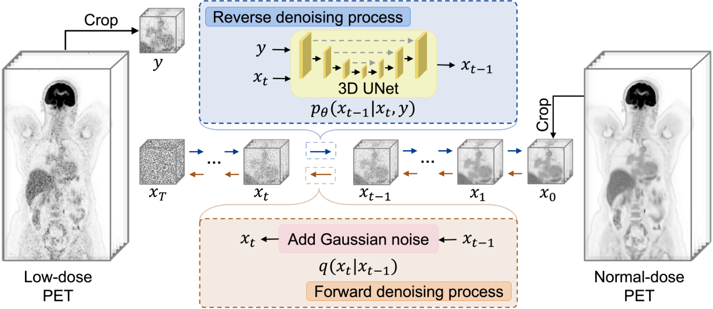
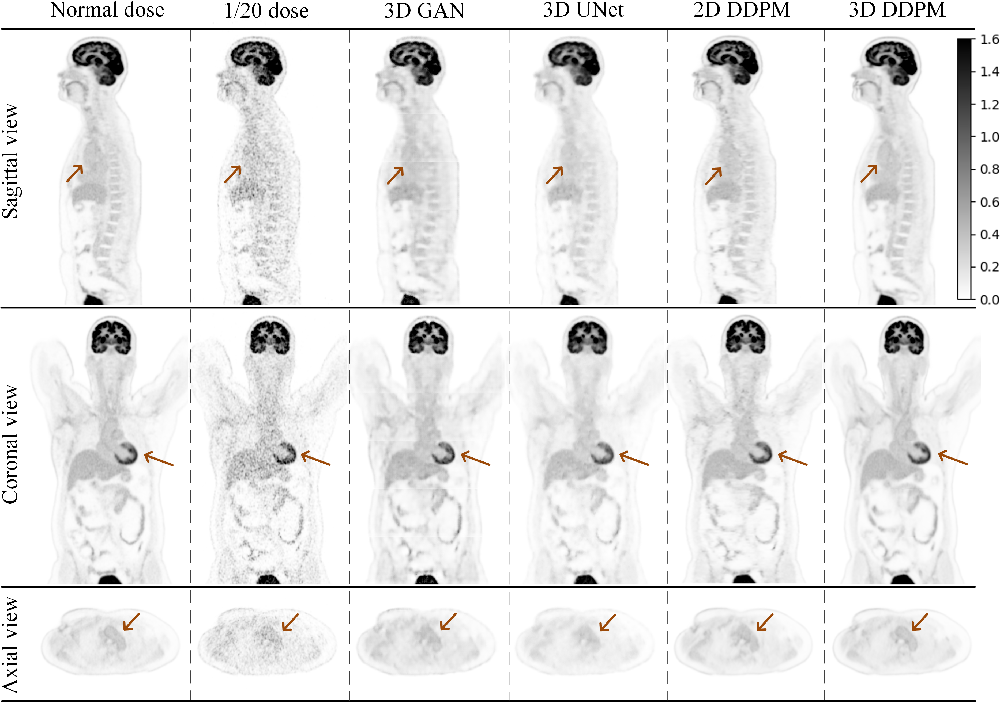

<h2 align="center"><a href="https://link.springer.com/article/10.1007/s00259-025-07122-4">Robust Whole-body PET Image Denoising Using 3D Diffusion Models: Evaluation Across Various Scanners, Tracers, and Dose Levels</a></h2>
<div align="center">
  <span class="author-block">
    Boxiao Yu<sup>1</sup>,</span>
  <span class="author-block">
   Savas Ozdemir<sup>2</sup>,</span>
  <span class="author-block">
    Yafei Dong<sup>3</sup>,</span>
  <span class="author-block">
    Wei Shao<sup>4</sup>,</span>
  <span class="author-block">
    Tinsu Pan<sup>5</sup>,</span>
  <span class="author-block">
    Kuangyu Shi<sup>6</sup>,</span>
  <span class="author-block">
    Kuang Gong<sup>1</sup>
</div>
<div align="center">
  <span class="author-block"><sup>1</sup>J. Crayton Pruitt Family Department of Biomedical Engineering, 
     University of Florida;</span>
  <span class="author-block"><sup>2</sup>Department of Raiology, University of Florida;</span>
  <span class="author-block"><sup>3</sup>Yale School of Medicine, Yale University;</span>
  <span class="author-block"><sup>4</sup>Department of Medicine, University of Florida;</span>
  <span class="author-block"><sup>5</sup>Department of Imaging Physics, University of Texas MD Anderson Cancer Center;</span>
  <span class="author-block"><sup>6</sup>Department of Nuclear Medicine, University of Bern</span>
</div>

> 📢 **Updates**  
> - 📈 Evaluation script `evaluation/get_ssim_psnr.py` added to compute **SSIM** and **PSNR**
> - ✅ Added support for overlapping patch-based inference in `scripts/test.py`  
> - 💡 Included detailed comments and flexible slicing logic for customizing your own inference pipeline  
> - 📏 Reminder: Input PET volumes should be resampled to **1.65×1.65×1.65 mm³** voxel size and converted to **SUV units**


## Purpose

Whole-body PET imaging plays an essential role in cancer diagnosis and treatment but suffers from low image quality. Traditional deep learning-based denoising methods work well for a specific acquisition but are less effective in handling diverse PET protocols. In this study, we proposed and validated a 3D Denoising Diffusion Probabilistic Model (3D DDPM) as a robust and universal solution for whole-body PET image denoising. 

## Method

<p align="center">
  
</p>
The proposed 3D DDPM gradually injected noise into the images during the forward diffusion phase, allowing the model to learn to reconstruct the clean data during the reverse diffusion process. A 3D convolutional network was trained using high-quality data from the Biograph Vision Quadra PET/CT scanner to generate the score function, enabling the model to capture accurate PET distribution information extracted from the total-body datasets. The trained 3D DDPM was evaluated on datasets from four scanners, four tracer types, and six dose levels representing a broad spectrum of clinical scenarios.

## Result

<p align="center">
  
</p>
The proposed 3D DDPM consistently outperformed 2D DDPM, 3D UNet, and 3D GAN, demonstrating its superior denoising performance across all tested conditions. Additionally, the model’s uncertainty maps exhibited lower variance, reflecting its higher confidence in its outputs.  

## Installation
### Step 1: Clone the Repository

    git clone https://github.com/Miche11eU/PET-Image-Denoising-Using-3D-Diffusion-Model.git
    cd PET-Image-Denoising-Using-3D-Diffusion-Model

### Step 2: Create and activate the conda environment from the environment.yml file:

    conda env create -f environment.yml
    conda activate PET-3D-DDPM

### Step 3: Download Pre-trained Models
Download the pre-trained model files from this [link](https://www.dropbox.com/scl/fo/nj52fz7p23icnkxo3v5y2/AAsggV-0DAuJjd4ILYAE1m4?rlkey=uivlrx0oi68l7n34fkbmamkdj&st=fztnoohh&dl=0) and place them into the `./checkpoint/` folder.

**Note**: This model is licensed under CC BY-NC-SA 4.0. **Commercial use is prohibited.**


## Testing

### Data Preparation

The model was trained using PET images with a voxel size of **1.65 × 1.65 × 1.65 mm³**, so **all testing data should be resampled to this voxel size before inference**.  
Also, ensure that the low-dose PET input is converted to **SUV units** prior to being passed into the model.

By default, our script assumes the test data volume shape is [192, 288, 520]. The volume is split along the axial axis into 6 overlapping patches** of size [192, 288, 96], each overlapping with its neighbor by 10 pixels, which helps to generate smoother transitions at patch boundaries.


### Running the Denoising Script
Before running the denoising script, modify the `load_data_for_worker` function and `reverse_2_original_dimension` function in `./scripts/test.py` to align with your data format and dimensions. We provide the script `./scripts/test.py` for testing with overlapping patch inference built-in. A shell launcher (`test_DDPM_3d_mpi.sh`) is available to assist multi-GPU inference.

#### Script Usage

- `--base_samples`: Path to the `.npz` files containing your low-dose PET images.
- `--num_samples`: Total number of samples to process (typically equals number of patches).
- `-n`: Number of GPUs to utilize for parallel processing.
- `--save_dir`: Output directory to store the denoised image results.

### Customizing for Different Input Shapes

For PET volumes of different dimensions (e.g., `[192, 304, 612]`), we provide an example script: `scripts/test_192_304_612.py`, which demonstrates how to:

- Divide the input into different overlapping patches
- Adjust the slicing logic and reconstruction scheme accordingly

Users can refer to this script and modify it to match their own PET volume dimensions and overlapping strategies. You are encouraged to use larger overlaps (e.g., >10 pixels) if smoother patch merging is desired.

### Notes

- The inference scripts handle patch stitching automatically and convert back to the original input shape after denoising.
- You may modify the overlap size, number of patches, or patch locations depending on your GPU memory and data characteristics.


## Evaluation

To quantitatively assess the denoising performance, we provide an evaluation script located at `./evaluation/get_ssim_psnr.py`. This script computes SSIM and PSNR between the denoised PET images and the ground-truth normal-dose PET.


## License

- The **code** in this repository is licensed under the **MIT License**.
- The **model weights** are licensed under **CC BY-NC-SA 4.0**, meaning:
  - You **can** share and modify the model weights, but **must** use the same license.
  - You **cannot** use it for **commercial purposes**.

For details, check:
- [LICENSE](./LICENSE.txt) (MIT for code)
- [MODEL_LICENSE](./MODEL_LICENSE.txt) (CC BY-NC-SA 4.0 for model weights)

## Citation
If you find our work is useful in your research or applications, please consider giving us a star 🌟 and citing it by the following BibTeX entry.

```bibtex
@article{yu2025robust,
  title={Robust whole-body PET image denoising using 3D diffusion models: evaluation across various scanners, tracers, and dose levels},
  author={Yu, Boxiao and Ozdemir, Savas and Dong, Yafei and Shao, Wei and Pan, Tinsu and Shi, Kuangyu and Gong, Kuang},
  journal={European Journal of Nuclear Medicine and Molecular Imaging},
  pages={1--14},
  year={2025},
  publisher={Springer}
}
```

## Contact

For any questions or inquiries, please contact boxiao.yu@ufl.edu.

